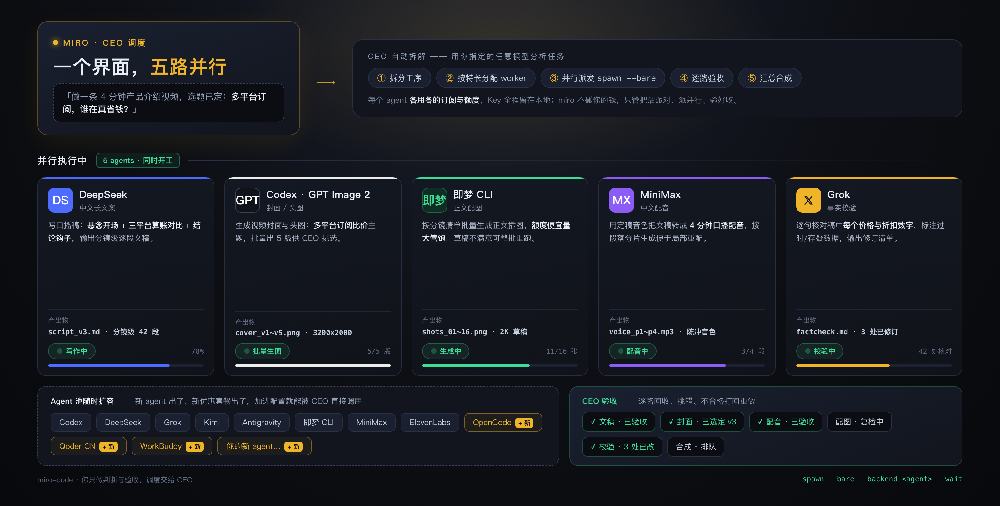

# miro-code

> **一个界面，调度你所有的 AI agent。** Claude Code · Codex · Grok · Kimi · Antigravity · OpenCode · 即梦 · MiniMax —— 每家各用各的订阅与额度，miro 只干三件事：**调度、分配、验收**。

    

**[English](#english-tldr) | [中文使用教程](docs/miro/tutorial.zh.md) | [GitBook 在线版](https://xlegao.gitbook.io/mirobiz/)** · Fork of [kiyor/soul-cli](https://github.com/kiyor/soul-cli) — thanks to @kiyor for the excellent upstream.

---

## Why miro-code?

你手里已经有了好几家的订阅：Claude、Codex、xAI、Kimi、Google……但它们各自关在各自的终端里——

- 新模型一出，就要**重新订阅、重新学一套界面**，旧订阅的余额躺在那里折旧；
- 一条 4 分钟的视频，要手动跑到 **5 个平台**：写稿一个站、生图一个站、配音一个站……
- 每家各有特长，却没有一个入口能让它们**同时开工**；
- Claude Code 本身很强，但每次冷启动都是白纸，也不知道你还有哪些 worker 可以差遣。

miro-code 补的就是这一块：**你当验收人，miro 当 CEO**——把任务拆解、按特长派给最合适的 agent、并行推进、逐路验收。你只做判断。

**One Interface, Many Agents** —— 所有已适配的 agent 从同一个界面调用，各花各的额度，Key 全程留在本地。
**池子随生态生长** —— 出了新 agent、新优惠套餐，加进配置就能被 CEO 直接调用，不换界面、不改习惯。
**真活并行干** —— 串行做要一下午的工序，并行做只要一轮。
**带着记忆干活** —— Claude Code 每次冷启动自动继承你的身份、偏好、项目前史。
**不碰你的钱** —— 不转售 Key、不代充、不归集余额；调度归 miro，额度归你自己。

## 效果图：一条 4 分钟视频，五路并行

拿「多平台订阅，谁在真省钱？」这个选题举例。你只说一句话：**「做一条 4 分钟产品介绍视频，选题已定。」**



| 工序 | 派给谁 | 为什么是它 |
|---|---|---|
| 分析任务、拆分工序 | 任意你指定的模型 | CEO 的思考层，你说了算 |
| 写中文口播稿 | **DeepSeek**（经 opencode backend） | 中文长文案强、单价低 |
| 封面 / 头图，批量出 5 版 | **Codex · GPT Image 2** | 高质量生图，供你挑选 |
| 正文配图 16 张 | **即梦 CLI** | 额度便宜量大管饱，草稿可整批重跑 |
| 中文配音 | **MiniMax** | 定稿音色、分片生成便于局部重配 |
| 事实校验 | **Grok** | 逐句核对每个价格数字，输出修订清单 |
| 机动产能 | **OpenCode / Qoder / WorkBuddy** | 按各家配额与优惠灵活加派 |

五路同时开工，互不等待；CEO 逐路回收、挑错、不合格打回重做，最后汇总合成。

## Features

### Agent 调度与并行

- `miro spawn --bare` 把有界任务派给外部 CLI，Claude 是默认监督者
- 多路任务并行推进、互不等待，结果统一回到当前会话
- 每路任务指定项目路径、任务内容、验收方式——worker 只做分配内的事

### Agent 池扩容

- 对话型 agent 注册为 backend（`codex` / `grok` / `kimi` / `agy` / `opencode`）
- 工序型工具（生图、配音、部署类 CLI）注册在 `tools` 下，同一项目环境执行
- 新 agent 进配置即入池，调用入口永远是这一个

### 身份与记忆注入

- `SOUL.md` / `USER.md` / `MEMORY.md` / `AGENTS.md` 组装进系统提示词，冷启动不再白纸
- 每日笔记自动蒸馏进长期主题，FTS5 全文检索历史经验
- 纠正过的行为沉淀成规则，下次启动自动生效
- 二进制名即身份：`miro` / `jarvis` / `atlas` 多实例数据完全隔离

### Server 模式与自动化

- 常驻 HTTP API + Web UI（PWA，可加手机主屏），实时流式输出
- Telegram 通知与对话注入；会话间 IPC 互发消息
- `--cron` 记忆整理 / `--heartbeat` 健康巡逻 / `--evolve` 自我改进（带自动回滚）

### 安全设计

- 拒绝符号链接写入、密钥泄漏检测、CORE 人格文件保护
- Server 默认只监听本机（`127.0.0.1`），所有 API 强制鉴权

## FAQ

**我的 Key 安全吗？会不会被转售或归集？**
Key 全程留在你本机，miro-code 不托管、不上传、不转售。每个 agent 消耗的是它自己账号的额度。

**我只有 Claude Code 一个订阅，有用吗？**
有用。身份与记忆注入不需要任何第二家；后续接入其他 CLI 时随时平滑扩展，配不齐五家也能跑。

**和 CC Switch 有什么区别？**
CC Switch 管的是「连上谁」——供应商与接口切换；miro-code 管的是「下一步叫谁」——在同一个会话里把任务派给多个 agent 并验收结果。两者可以共存。

**新 agent 出来了怎么接入？**
对话型 CLI 实现对应 backend 即入池；工序型工具（生图、配音、部署）注册在 `tools` 下。不改界面、不改操作习惯。

**哪些能力还在路上？**
统一的多模型花费记账、worker 健康探针与自动降级、旗舰长视频工作流插件——都在路线图上，README 与文档只声明已实现的能力。

**Windows 能用吗？**
建议 WSL2 + Linux 流程；仓库提供一键部署引导（把 `bootstrap.md` 喂给 Claude Code 全自动安装）。

## Quick Start

**前置**：Go 1.25+、[Claude Code](https://docs.anthropic.com/en/docs/claude-code) 已登录。

1. **克隆并编译**

   ```bash
   git clone https://github.com/gaoios/miro-code.git && cd miro-code
   go build -o miro . && mv miro ~/go/bin/
   ```

2. **初始化工作区**

   ```bash
   miro init        # 交互式向导；或全参数免交互：
   miro init --archetype engineer --name kuro --owner alex --tz Asia/Shanghai --yes
   ```

3. **启动** —— 这次它记得你

   ```bash
   miro
   ```

4. **派发第一个跨 agent 任务**（先 `miro server` 常驻）

   ```bash
   miro spawn --bare --backend grok --model grok-4.6 \
     --project /absolute/path/to/repo \
     "对抗性审查上一个实现，列出最危险的 3 个隐患" --wait
   ```

> **Note**：`--bare` + `--model` 缺一不可——`--bare` 确保任务真正派给外部 CLI（不带会跑 Claude 换皮）；`--model` 用该 CLI 的原生模型名，传错会报 `backend error`。

### 人格原型

| 原型 | 风格 |
|---|---|
| `companion` | 情绪在场，记得小事，读得懂气氛 |
| `engineer` | 技术同侪，代码优先，干燥幽默 |
| `steward` | 运营管家，主动、有条理、安静可靠 |
| `mentor` | 耐心老师，苏格拉底式提问 |
| 自定义 | 用关键词描述，init 帮你生成 |

首次对话后，AI 会根据你的实际说话方式自动充实人格（day-0 自我丰富）。

## Documentation

- **中文使用教程**：[docs/miro/tutorial.zh.md](docs/miro/tutorial.zh.md)
- **GitBook 在线版**：<https://xlegao.gitbook.io/mirobiz/>
- **上游英文文档**：<https://kiyor.github.io/soul-cli/>
- **CLI Reference**：[docs/reference/cli.md](docs/reference/cli.md)

## Architecture

```
┌──────────────────────────────────────────────────────────────┐
│  你（验收人）——只做判断                                        │
└──────────────────────────┬───────────────────────────────────┘
                           │ 一句话任务
┌──────────────────────────▼───────────────────────────────────┐
│  miro CEO 层：拆解 → 按特长分配 → 并行派发 → 逐路验收 → 合成     │
│         （身份/记忆/技能装配 · SQLite 会话库 · FTS5 检索）       │
└───┬──────────┬──────────┬──────────┬──────────┬──────────────┘
    ▼          ▼          ▼          ▼          ▼
 Claude     Codex       Grok       Kimi      Antigravity …OpenCode
 (cc)     (GPT Image 2) (校验)    (长文档)    (Gemini)   (DeepSeek 系)
    └──────────┴──────────┴───── 各用各的订阅与额度，Key 在本地 ─────┘
```

设计原则：**调度归 miro，内容归 worker，判断归你，额度归各家**。命令行细节见 [CLI Reference](docs/reference/cli.md)。

## 与上游的关系

本仓库 fork 自 [kiyor/soul-cli](https://github.com/kiyor/soul-cli)（v1.12.0 基线），在此之上维护 Miro Code 品牌的中文文档、部署实践与产品化迭代。命令层面当前仍为 `miro`（独立发行包规划中）。

## Contributing

欢迎 PR：bug 修复、新 backend 适配、最佳实践与榜单数据（走 [best-practice schema](docs/miro/) 提交）。提交前请确认 `go build ./...` 与 `go test ./...` 全过。

## License

MIT
