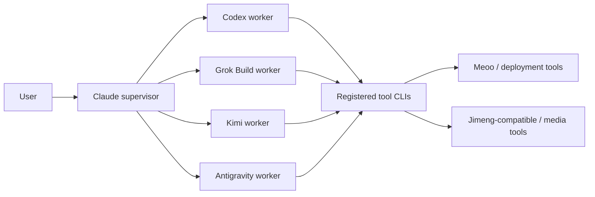

# Multi-CLI Agent Workspace

Soul can expose multiple AI CLIs through one server, session API, Web UI, and
supervisor prompt. The design separates conversational **workers** from
non-conversational **tool CLIs**.

## Architecture



AI workers implement the common `Backend` interface and emit `UnifiedEvent`
records. Tool CLIs remain ordinary executables available in the shared project
environment. A supervisor assigns a task to a worker and tells that worker
which tool to invoke.

## Backend Matrix

| Backend | Protocol | Session model | Typical role |
|---|---|---|---|
| Claude Code (`cc`) | stream-json | long-lived | supervisor, analysis, task decomposition |
| Codex (`codex`) | app-server JSON-RPC | long-lived | implementation, debugging, tests |
| Grok Build (`grok`) | headless JSON | bounded turn | independent review, alternate approach |
| Kimi CLI (`kimi`) | print mode | bounded turn | frontend presentation, visual QA |
| Antigravity (`agy`) | print mode | bounded turn | synthesis, comparison, Gemini perspective |

Enabling a backend does not make it the default. Explicit `--backend`, model
prefixes such as `codex/` or `agy/`, and `model_map` aliases control routing.

## Configuration

```json
{
  "agents": {
    "codex": {
      "enabled": true,
      "binary": "codex",
      "dispatch_hint": "Use as the primary implementation worker."
    },
    "grok": {
      "enabled": true,
      "binary": "grok",
      "dispatch_hint": "Use for independent review."
    },
    "kimi": {
      "enabled": true,
      "binary": "kimi",
      "model_map": {"frontend": "kimi-code/k3"},
      "dispatch_hint": "Use for visually demanding frontend work."
    },
    "agy": {
      "enabled": true,
      "binary": "agy",
      "mode": "plan",
      "effort": "low",
      "dangerously_skip_permissions": false,
      "model_map": {"gemini-pro": "gemini-3.1-pro-low"},
      "dispatch_hint": "Use selectively for synthesis and plan comparison."
    }
  },
  "tools": {
    "meoo": {
      "enabled": true,
      "binary": "meoo",
      "capabilities": ["build applications", "deploy static sites"],
      "dispatch_hint": "Verify authentication and project status before deploy."
    },
    "jimeng": {
      "enabled": false,
      "binary": "jimeng",
      "capabilities": ["generate images", "generate video assets"],
      "dispatch_hint": "Enable after verifying a non-interactive CLI contract."
    }
  }
}
```

`dispatch_hint` is local policy. It is the correct place for account-specific
quota, cost, role, and priority guidance.

Antigravity defaults to `mode: "plan"`. Enable `accept-edits` and
`dangerously_skip_permissions` only in a trusted workspace where unattended
file changes are intended.

## Usage

Start the server and use Soul normally:

```bash
soul server
soul
```

Explicit selection is intended for diagnostics and reproducible automation:

```bash
soul spawn --bare --backend codex --model gpt-6-astra --project "$PWD" \
  "Implement the requested change and run tests" --wait

soul spawn --bare --backend grok --project "$PWD" \
  "Review the implementation without relying on the author's conclusion" --wait

soul spawn --bare --backend agy --model gemini-3.1-pro-low --project "$PWD" \
  "Compare the proposed architectures and list unresolved assumptions" --wait
```

## Adding Another AI Backend

1. Add a `BackendKind` and implement the `Backend` interface.
2. Convert native output into `UnifiedEvent` records.
3. Register config loading, explicit API/WS selection, model routing, and the
   server bridge.
4. Add fake-binary unit tests, routing tests, bridge tests, and a real smoke
   script.

## Adding Another Tool CLI

1. Install and authenticate the executable outside Soul.
2. Verify a bounded, non-interactive command manually.
3. Add it under `tools` with `enabled`, `binary`, `capabilities`, and a concise
   `dispatch_hint`.
4. Keep it disabled until the command contract is verified. Registration does
   not install the CLI or grant credentials.

## Current Boundaries

- Soul does not bypass vendor quotas, subscriptions, or authentication.
- Bounded print-mode workers do not yet preserve native multi-turn context.
- Tool registration advertises local capability; it does not create a new AI
  worker or guarantee that an executable is installed.
- Concurrent workers should use separate worktrees or directories when they
  can edit the same repository.
